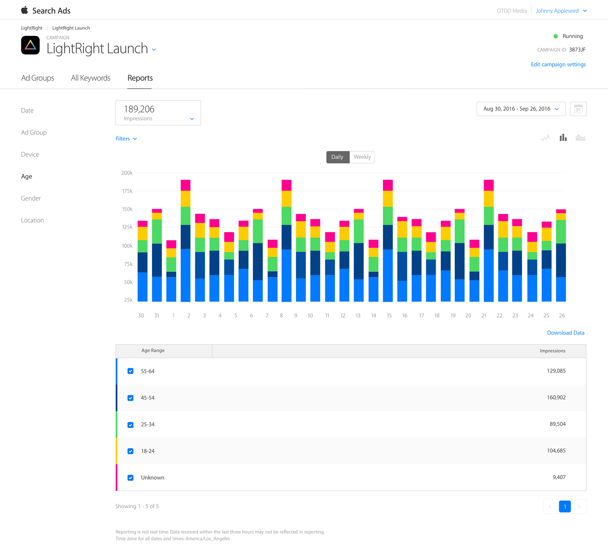

## Understanding reports 理解报告

访问“搜索广告报告”部分，深入了解广告系列的效果。 您可以按日期，广告组或关键字查看，并绘制各种指标：

* Spend 花费
* Taps 点击量
* App downlaods 应用下载量
* TTR（tap-through rate）点击转化率
* Average CPA 平均每次下载成本
* Average CPT 平均每次点击成本
* Impressions 曝光量

您也可以按设备过滤数据。

注意：报表不包含应用内购买的数据。此外，搜索广告不支持使用第三方跟踪网址变量。但是，如果您想要跟踪客户的生命周期价值，请考虑实施搜索广告归因API。

您在页面上看到的图表将根据您选择的参数自动更改。 使用其上方的下拉菜单选择指标选项，然后从左侧导航中选择报告类型。



**如何查找报告**

要访问“报告”页面，请登录您的帐户。 您将看到“广告系列”屏幕。 下一个：

* 选择您要查看的广告系列。
* 在广告系列概览屏幕中，点击报告标签。
* 选择您要查看和过滤详细报告的方式。

**如何阅读报告**

**1）图表视图**
“报告”页面顶部的图表视图为您提供了按日期列出的效果指标的快照。 您可以过滤视图并比较指标，以便深入了解广告系列数据。 注意：日期视图是唯一允许您选择多个指标的视图。

过滤器选项将显示在图表的左上角，一旦应用，将持续显示，直到您删除或更改。 当你调整过滤器，你会立即看到一个新的视觉效果。


**2）表视图**
根据您选择的过滤器和指标，表格会合并所选视图中每个组的总计。 可用的过滤器取决于您的视图。


**性别，年龄和位置报告视图中的“User Withheld”**

如果您未在广告组或广告系列中应用受众群体详情，则可能会在报告数据视图中的年龄，性别或地理位置部分下面显示一个标题为“User Withheld”类别。 这反映了一些看到您的广告的用户已在其设备上启用“限制广告跟踪”或停用位置服务。

**年龄范围报告**

按年龄查看报告时，指标会分组为以下预设年龄组：18-24岁，25-34岁，35-44岁，35-54岁，55-64岁，65岁以上。

**报表视图中的“Low Volume”指示器**

某些报告可能会返回“Low Volume”的值。这意味着您请求的数据低于Apple的隐私权阈值。例如，搜索字词必须至少达到10次展示，否则“搜索字词”报告中会显示“Low Volume”值。年龄，性别或位置报告需要至少100次展示，然后搜索广告才能显示任何值。

---

## Report definitions 报告定义

不确定你在看什么，或寻找？这里有一个指南，您可以在排序搜索广告效果数据时看到这些字词和缩略词。

**Impressions 曝光量**
您的赞助广告在报表时间段内在App Store搜索结果中显示的次数。

**Taps 点击数**
在报告时间段内用户点击您的广告的次数。

**Conversions 下载数**
报告期内由赞助广告产生的下载或重新下载总次数。搜索广告的转化次数归因于30天的点击后到达期。

**TTR 点击转化率**
点击率（TTR）是客户点击您的广告的次数除以您的广告获得的总展示次数。

**CR 下载转化率**
转化率（CR）是一个时段内接收到的转化总数除以同一时段内的总点击数。

**Avg CPA 平均每次转化费用**
平均每次转化费用（CPA）是总支出除以一段时间内获得的转化次数。

**Spend 花费**
每个客户点击广告的费用总和。

---

## Attribution API 归因API

**关于搜索广告API**

通过搜索广告归属API，您可以跟踪和归因于来自搜索广告系列的应用下载。 很容易准确地测量新获得的用户的生命周期价值和您的广告活动的有效性。

**API优点**

只要在应用程式中加入几行程式码，即可轻松了解不同客群的价值，以及促成转换的关键字。 您可以使用此信息为不同的关键字，广告组和受众群体优化您的CPT和CPA目标。

**API要求**

该应用必须启用搜索广告归因代码才能跟踪归因。

您随时可以启用应用程式的归属功能，以追踪由搜寻广告活动带来的应用程式下载次数。

归因仅适用于运行iOS 10或更高版本的用户，他们点击了搜索广告系列，并在30天内下载了该应用。

**如何实现API**

要启用您的应用归因功能，请按照下列步骤操作：

1. 将iAd框架添加到应用程序的Xcode项目文件中。
2. 在包含您的归因代码的文件中导入iAd标头：
  #import <iAd/iAd.h>
3. 检查搜索广告归因，并使用广告系列报告中的结果。

```objective-c
// Check for iOS 10 attribution implementation
if ([[ADClient sharedClient] respondsToSelector:@selector(requestAttributionDetailsWithBlock:)]) { 
NSLog(@"iOS 10 call exists"); 
[[ADClient sharedClient] requestAttributionDetailsWithBlock:^(NSDictionary *attributionDetails, NSError *error) { 
// Look inside of the returned dictionary for all attribution details
NSLog(@"Attribution Dictionary: %@", attributionDetails); 
}];
}
```

以下是来自归因API的响应对象（版本3.1），其中包含广告系列层次结构详细信息，隐藏关键字，下载日期和点击日期。

```json
{
"Version3.1" = { 
"iad-attribution" = true;
"iad-org-name" = "Light Right"; 
"iad-campaign-id" = 15292426; 
"iad-campaign-name" = "Light Bright Launch"; 
"iad-conversion-date" = "2016-10-14T17:18:07Z";
"iad-click-date" = "2016-10-14T17:17:00Z";
"iad-adgroup-id" = 15307675; 
"iad-adgroup-name" = "LightRight Launch Group"; 
"iad-keyword" = "light right"; 
}; 
}
```

[查看完整API文档](http://searchads.apple.com/help/pdf/attribution-api.pdf)

---

## Privacy 隐私

**搜索广告和隐私权**

Apple收集的所有搜索广告数据都必须遵守Apple隐私政策，Apple不会将数据出售给第三方。 搜索广告不会使用来自其他Apple服务（例如Google地图，Siri，iMessage和iCloud）的用户个人数据，也不会通过服务和功能（例如健康，HomeKit，电子邮件，联系人和通话记录）从用户设备获取用户的个人数据。

用户还可以通过使用限制广告跟踪功能选择停止接收定位广告。 默认情况下，对儿童的Apple ID帐户启用限制广告跟踪。
搜索广告的下载归因是以尊重隐私的方式完成的。 

新获得的客户打开您的应用后，您的应用会查询客户的设备，以确定下载是否可归因于搜索广告：

* 查询完全在设备上进行;
* 您只能对应用程序的当前客户执行查询; 和
* 用户可以启用限制广告跟踪功能来阻止查询。


